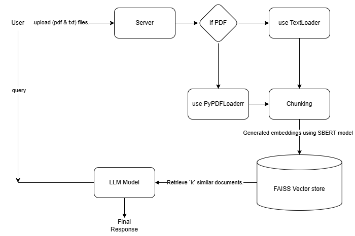

# 📚 RAG-Based QA System

## 📌 Overview

This project is a **Retrieval-Augmented Generation (RAG) based Question Answering system**.
It allows users to ask questions from a PDF document and get accurate answers using a combination of **vector search (FAISS)** and **LLM (Groq - LLaMA model)**.

---

## Architecture Diagram



---

## 📂 Project Structure

```
RAG-QASYSTEM/
│
├── app/
│   ├── main.py              # CLI entry point
│   ├── api.py               # FastAPI server
│   ├── pipeline.py          # RAG pipeline logic
│   ├── config.py            # Configuration settings
│
├── rag/
│   ├── indexing.py          # Create vector DB
│   ├── retriever.py         # Load + retrieve docs
│   ├── generator.py         # LLM + chain logic
│
├── prompts/
│   └── prompt.json          # Prompt template
│
├── data/                    # Input PDF files
│
├── vector_store/            # FAISS index files
│
├── utils/
│   ├── logger.py            # Logging
│   ├── prompt_generator.py  # Prompt utilities
│
├── .env                     # API keys
├── requirements.txt
└── README.md
```

---

## 🚀 Setup Instructions

### 1. Clone Repository

```
git clone https://github.com/pravesh24X7/RAG-QAsystem.git
cd RAG-QAsystem
```

### 2. Create Virtual Environment

```
python -m venv env01
env01\Scripts\activate   # Windows
```

### 3. Install Dependencies

```
pip install -r requirements.txt
```

---

## 🔑 Environment Variables

Create a `.env` file and add:

```
GROQ_API_KEY=your_api_key_here
HF_TOKEN=your_huggingface_token
```

---

## 📥 Step 1: Add PDF

Place your PDF inside:

```
data/
```

Example:

```
data/sample.pdf
```

---

## 🧠 Step 2: Create Vector Store

Run indexing:

```
python rag/indexing.py
```

This will:

* Load PDF
* Split into chunks
* Create embeddings
* Store in FAISS (`vector_store/`)

---

## 💬 Step 3: Run QA System (CLI)

```
python -m app.main
```

Example:

```
HUMAN: What is the topic of the document?
AI: The document discusses ...
```

---

## 🌐 Step 4: Run API (Optional)

Start FastAPI server:

```
uvicorn app.api:app --reload
```

Test endpoint:

```
POST /ask?query=your_question
```

---

## 🧪 Debugging Tips

If system says:

```
"I don’t have enough information"
```

Check:

* Vector store exists (`index.faiss`, `index.pkl`)
* Correct PDF is indexed
* Chunk size and overlap are properly set
* Retriever is returning relevant documents

---

## ⚡ Key Technologies

* LangChain
* FAISS (Vector DB)
* HuggingFace Embeddings
* Groq (LLaMA model)
* FastAPI

